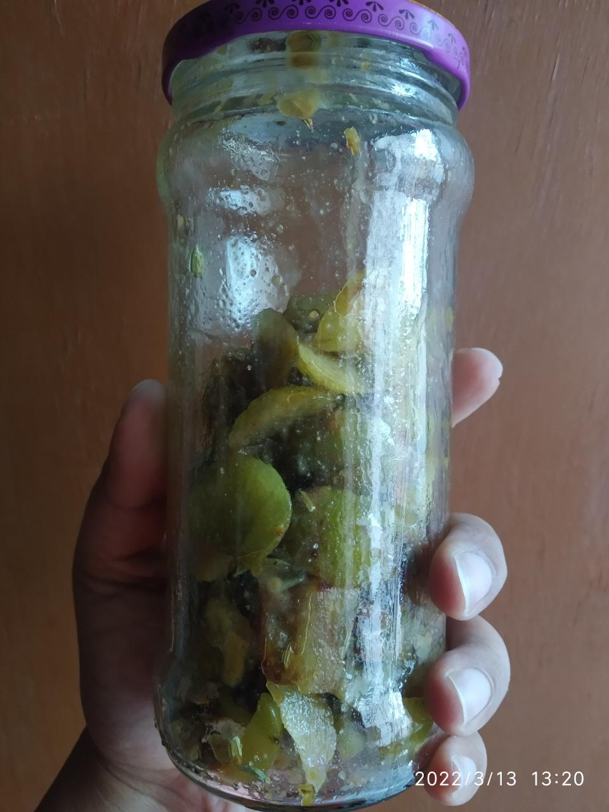
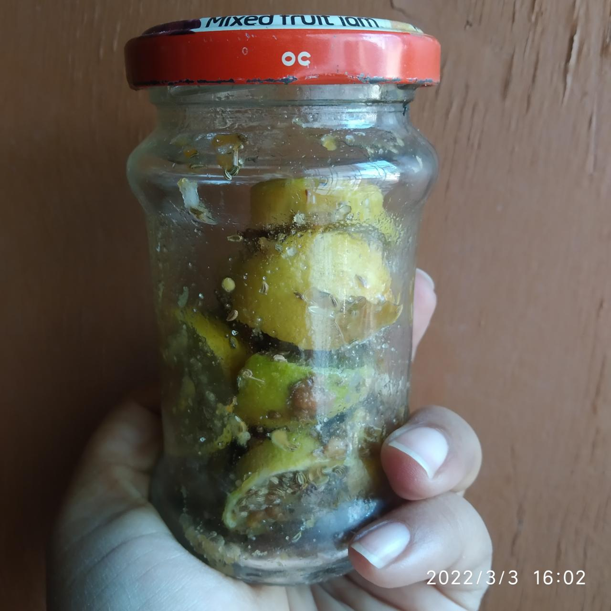
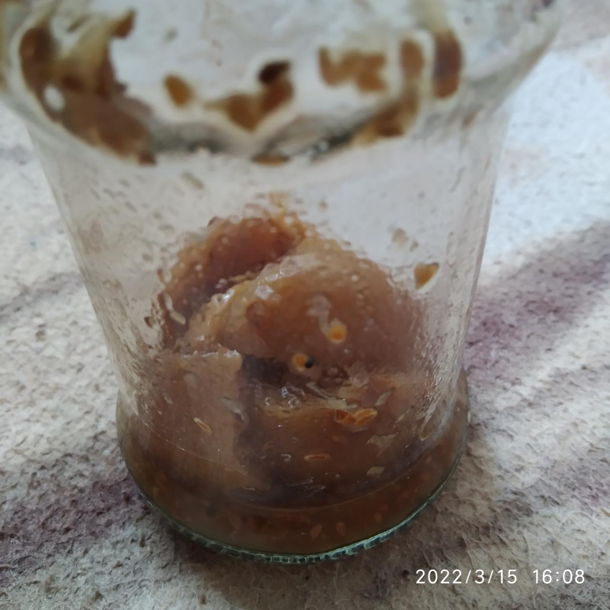

# Oil Less Pickles

Latest on top

## 2022

### 2022-03-13

Amla Pickle

- Sliced amlas, (sendha) salt, _shakkar_ (more, to make it sweet), saunf mixed well. 
- Added in glass bottle and kept in sunlight. 

### 2022-03-03

**Lemon Pickle**

_Recipe by senior family friend aunty_

- Add (sendha) salt, _shakkar_, ajvain to lemon slices and mix well. No turmeric added in this pickle. Turmeric was suggested by family friend aunty. 
- Added to glass bottle and kept in sunlight. 
- Prepared in ten days. 

